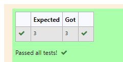

# RANK-OF-A-MATRIX
## Aim:
To write a python program to find the rank of a matrix
## Equipment’s required:
1. 	Hardware – PCs
2. 	Anaconda – Python 3.7 Installation / Moodle-Code Runner
## Algorithm:
### Step 1: 
import numpy as np
### Step 2:
Assign in np.array()in rank of matrix
### Step 3:
 Using the np.linalg.matrix_rank(), we can find the rank of the given matrix.
### Step 4:
print the value and end the program 
## Program:
```
#program to find the rank of matrix
#Devoloped by:Monisha T
#Registernumber:21500314
import numpy as np
A = np.array([[5,-3,-10],[2,2,-3],[-3,-1,5]])
value = np.linalg.matrix_rank(A)
print(value)

```

## Output:


## Result:
Thus the rank for the given matrix is successfully solved by  using a python program.

